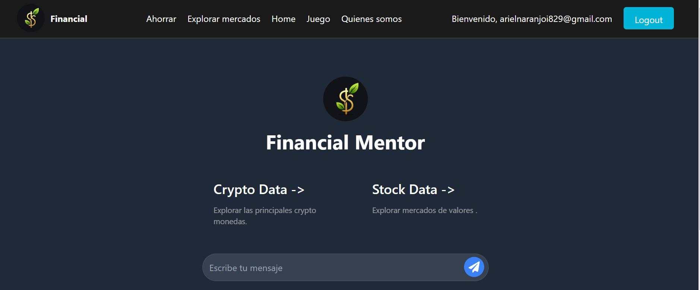
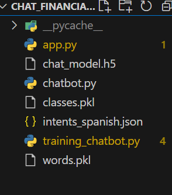
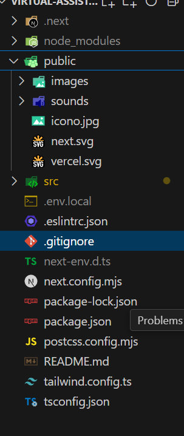

# TheBloodlineOfBlueBeam
En este espacio se sube el código creado para el grupo 




# Financial mentor

Financial Mentor es un asistente virtual financiero que ofrece soluciones rápidas y concisas sobre finanzas, gestión del tiempo, ahorro y criptomonedas. Proporciona consejos personalizados para inversiones, estrategias de ahorro, y muestra variaciones en precios de criptomonedas y acciones. Incluye una calculadora de ahorros y juegos interactivos para una experiencia educativa dinámica.


# Arquitectura de la creacion del modelo 




## Tabla de contenidos


* Financial Mentor


# Librerias 


- nltk
- json
- pickle
- numpy
- tensorflow
- keras
- random
- itertools


 Integración del proyecto en una pág web
## Getting Started
Utilizamos next.js 14 app router para Front   End 

# Arquitectura Front End


```bash
npm install

```
First, run the development server:

```bash
npm run dev
# or
yarn dev
# or
pnpm dev
# or
bun dev
```


- Tecnología/Herramientas usadas …
- react
- Typescrit
- Next.js
- supabase para la base de datos
  
